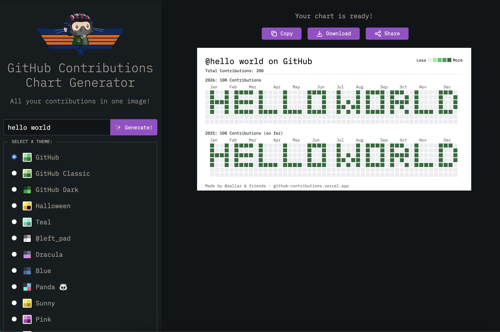

# GitContributionsDraw Package

## 使用方法

### 1.启动服务端
```bash
cd service/cmd
go run .
```

### 2.启动页面
```bash
cd web

npm install --verbose

npm run dev
```

### 3.打开页面
http://localhost:3000

键入“hello world”，显示如下


